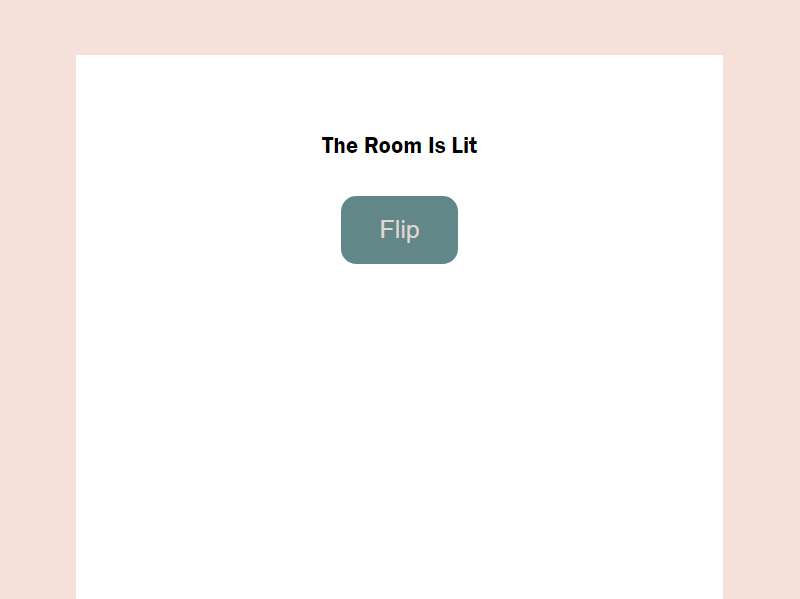

# Exercise Week 11

## Deploy a Url Shortener In Netlify

In this Assignment, I deploy your URL shortener to a web server
Deploy a production build to Netlify web server

[Click Hear To Check Deployed Application ](https://endearing-sprinkles-6bb77f.netlify.app/).

## Result Of Performance Benchmarking


#

## Redux Exercise 1


## Installation

```
go to ReduxExercise-1-redux-state-lightswitch folder

npm i

npm run
```

## Output

It’s a plain React app displaying a “Room” with a lightswitch. Clicking the button toggles the state, which turns the light on and off using redux.



#

## Redux Exercise 2


## Installation

```
go to ReduxExercise-2-steps-counter folder

npm i

npm run
```

## Output

It’s a plain React app incrementing steps and reset the steps using redux.

### I have used Redux Toolkit here


